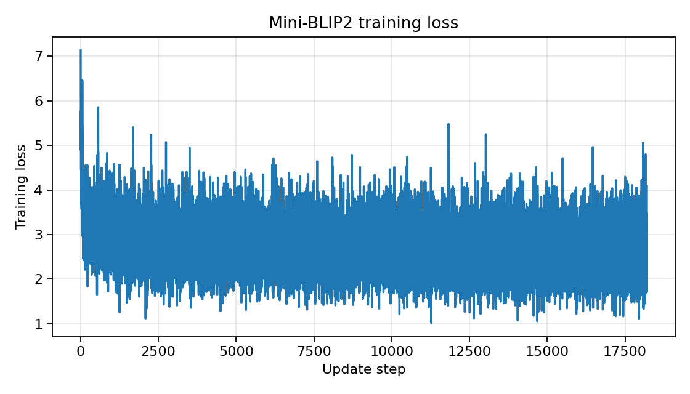
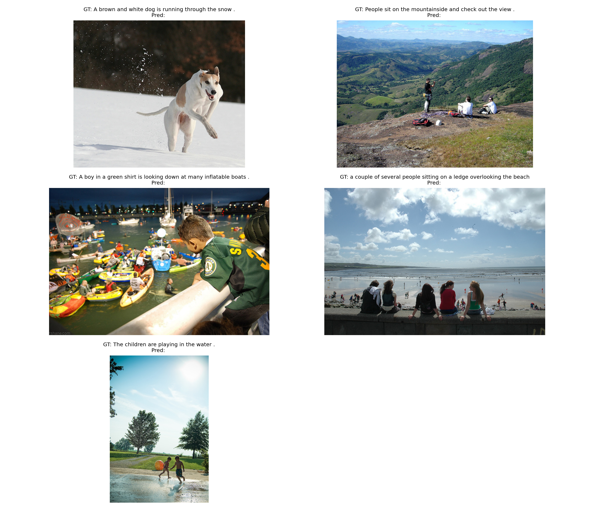

# Mini-BLIP2 图像描述生成复现实验报告

## 1. 论文信息

- 论文名称：BLIP-2: Bootstrapping Language-Image Pre-training with Frozen Image Encoders and Large Language Models
- 论文地址：https://arxiv.org/abs/2301.12597
- 论文 PDF：https://arxiv.org/pdf/2301.12597

## 2. 任务说明

本实验复现的任务是图像描述生成 Image Captioning。

输入：一张图片  
输出：一句英文 caption

本次实验不是完整复现 BLIP-2 的大规模预训练，而是按照 BLIP-2 的核心思想实现一个轻量版 Mini-BLIP2：冻结视觉编码器和语言解码器，只训练中间桥接模块，使模型能够从图像特征生成英文描述。

## 3. 数据集

- 数据集名称：Flickr8k
- 数据集地址：https://www.kaggle.com/datasets/adityajn105/flickr8k
- 实际使用数据量：前 200 张图片
- caption 数量：1000 条 caption，每张图片 5 条 caption
- 训练集：180 张图片，共 900 条 caption
- 验证集：20 张图片，共 100 条 caption
- 图片目录：`data/Images`
- 标注文件：`data/captions.txt`

数据读取方式：先从 `captions.txt` 读取图片文件名与 caption，再选择前 200 张实际存在于 `data/Images` 目录中的图片。训练和验证按图片划分，避免同一张图片同时出现在训练集和验证集中。

## 4. 模型结构

本实验实现的 Mini-BLIP2 结构如下：

```text
Image
  -> Frozen Vision Encoder
  -> Mini Q-Former
  -> Projection Layer
  -> Frozen Language Decoder
  -> Caption
```

整体思路是使用冻结的 CLIP 提取图像 patch 特征，用可训练的 query tokens 通过 Mini Q-Former 从图像特征中提取紧凑视觉表示，再通过线性投影层映射到 OPT 语言模型的 hidden size，最后作为语言模型的 prefix embedding 生成 caption。

### 4.1 Vision Encoder

- 使用模型：`openai/clip-vit-base-patch32`
- 模型类型：CLIP ViT-B/32 视觉编码器
- 输入尺寸：由 `CLIPImageProcessor` 处理为 `224 x 224`
- 输出特征：`last_hidden_state`
- 是否冻结：是

冻结视觉编码器的原因是本次实验数据量很小，训练完整视觉模型容易过拟合，并且不符合 BLIP-2 中冻结大规模视觉编码器的核心设定。

### 4.2 Mini Q-Former

本实验自己实现了一个简化版 Mini Q-Former。

- query token 数量：16
- hidden size：256
- Transformer 层数：2
- attention heads：8
- 是否使用 cross-attention：是
- 实现方式：使用 `nn.TransformerDecoderLayer`

Mini Q-Former 中包含一组可学习的 query tokens。每一层 decoder layer 中，query tokens 一方面进行 self-attention，另一方面对 CLIP 输出的视觉特征进行 cross-attention，从而得到与图像内容相关的视觉查询表示。

### 4.3 Projection Layer

- 输入维度：256
- 输出维度：OPT hidden size
- 作用：将 Mini Q-Former 的输出对齐到语言模型词向量空间
- 是否训练：是

该层负责把 Q-Former 输出的视觉表示转换为 OPT 可以接收的 prefix embedding。

### 4.4 Language Decoder

- 使用模型：`facebook/opt-125m`
- 模型类型：OPT causal language model
- 是否冻结：是
- tokenizer：`AutoTokenizer.from_pretrained("facebook/opt-125m")`

训练时将视觉 prefix embedding 与 caption token embedding 拼接后输入 OPT，使用 causal language modeling 的 cross entropy loss 训练图像到文本的对齐模块。

## 5. 训练设置

- 训练数据量：180 张图片，900 条 caption
- 验证数据量：20 张图片，100 条 caption
- epoch：1
- batch size：2
- learning rate：2e-4
- weight decay：0.01
- optimizer：AdamW
- max text length：40
- loss function：cross entropy loss，由 `OPTForCausalLM` 根据 labels 自动计算
- 运行设备：CUDA
- PyTorch 版本：2.2.2+cu121
- 总参数量：约 215.20M
- 可训练参数量：约 2.51M
- 冻结的模块：CLIP vision encoder、OPT language decoder
- 训练的模块：query tokens、Mini Q-Former、vision-to-Q-Former projection、Q-Former-to-OPT projection

## 6. 训练过程

训练过程已经在 `code/train.ipynb` 中跑通，并保存了 checkpoint 与 loss 曲线。

- checkpoint：`code/outputs/mini_blip2_flickr8k.pt`
- loss 曲线：`code/outputs/loss_curve.png`



训练日志如下：

| Epoch | Train Loss | Val Loss |
|---|---:|---:|
| 1 | 3.2629 | 2.6497 |

从 loss 可以看出，模型完成了正向传播、反向传播、参数更新和验证流程。由于本次只使用 200 张图片并训练 1 个 epoch，实验重点是跑通 Mini-BLIP2 的完整训练流程，而不是追求接近原论文的大规模性能。

## 7. 生成结果展示

生成示例图保存于：

- `code/outputs/generation_examples.png`



当前验证集上的 5 个例子如下：

| 图片编号 | 图片文件名 | 真实 Caption | 模型生成 Caption |
|---|---|---|---|
| 1 | `1220401002_3f44b1f3f7.jpg` | Two children are laughing in the grass . | （空输出） |
| 2 | `1222322358_225067636e.jpg` | A boy in a red and white shirt is on a swing . | （空输出） |
| 3 | `1224851143_33bcdd299c.jpg` | A boy eats with a spoon . | （空输出） |
| 4 | `1225443522_1633e7121f.jpg` | A girl walking alone at night on a street . | （空输出） |
| 5 | `1227655020_b11a1bb112.jpg` | A black dog and a brown dog playing in tall weeds . | （空输出） |

模型已经能够完成训练和调用生成接口，但当前生成结果为空，说明只训练 1 个 epoch 后视觉 prefix 与冻结 OPT 的文本生成空间尚未充分对齐，模型容易直接生成结束符或无有效文本。这是小数据量、短训练轮数和冻结语言模型条件下常见的问题。

## 8. 总结

本实验成功完成了 Mini-BLIP2 的核心流程复现：能够读取 Flickr8k 前 200 张图片及 caption，能够搭建冻结视觉编码器、可训练 Mini Q-Former、投影层和冻结语言解码器组成的模型，并且完成了训练、验证、保存 checkpoint、绘制 loss 曲线和调用 caption 生成接口。

生成效果目前还比较弱，验证样例中生成结果为空。主要原因是训练数据量只有 200 张图片，训练轮数只有 1 个 epoch，而 OPT 语言模型保持冻结，中间桥接模块需要更多训练才能学会把图像表示映射到有效文本空间。

如果继续改进，可以尝试：

- 增加训练 epoch，例如训练 5 到 20 个 epoch；
- 增大数据量，使用更多 Flickr8k 图片；
- 在生成时加入固定 prompt，例如 `A photo of`；
- 调整 learning rate、query token 数量和 Q-Former 层数；
- 使用更小或更容易微调的语言模型；
- 只解冻语言模型的一小部分参数或使用 LoRA 微调。

## 9. AI 对话过程记录

- 录制工具：entir.io
- 对话链接：本地 Entire 记录，见 `E:\program_prject\vscode_python_project\论文复现\blip2-main\.entire\metadata\codex-2026-05-22-blip2-train-report\conversation.md`
- 使用的 AI 模型：ChatGPT / Codex
- 累计对话时长 / 会话数：约 2 次会话，包含训练 notebook 编写、数据路径确认、报告填写和 Entire 记录整理

简要说明：

```text
本次实验中，AI 主要辅助完成 Mini-BLIP2 训练 notebook 的代码组织、数据读取逻辑、模型结构实现、训练流程和实验报告整理。实现过程中根据本地数据目录和实际训练输出进行了检查与修改，例如确认前 200 张图片位于 data/Images 目录，并根据真实训练日志填写 loss 与生成结果。当前 Codex 对话已整理到本地 Entire 目录 .entire/metadata/codex-2026-05-22-blip2-train-report/，其中 conversation.md 是可读记录，full.jsonl 是机器可读记录；如果老师要求公开链接，还需要再通过 entir.io 或 Entire CLI 分享。
```

## 10. Git 提交记录

- 仓库地址：https://github.com/senlongyunb/blip2-main.git
- 总 commit 数：6

`git log --oneline` 输出如下：

```text
6ffce0d master
5683fa7 master
a1c7b8a master
5cd0dc1 master
4e2ce31 master
ed7c29a master
```
