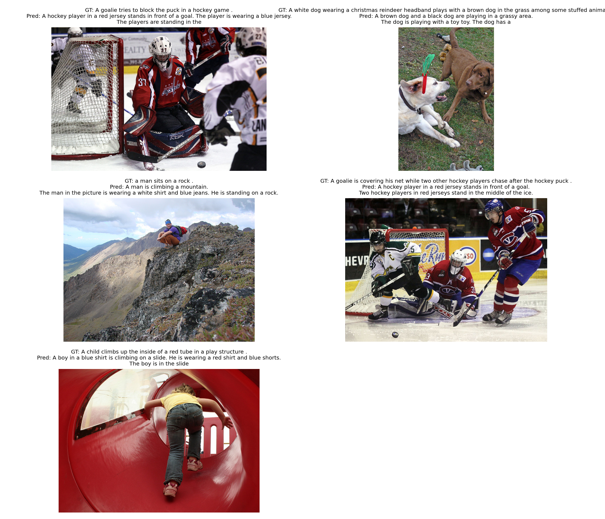

# Mini-BLIP2 图像描述生成复现实验报告

## 1. 论文信息

- 论文名称：BLIP-2: Bootstrapping Language-Image Pre-training with Frozen Image Encoders and Large Language Models
- 论文地址：https://arxiv.org/abs/2301.12597
- 论文 PDF：https://arxiv.org/pdf/2301.12597

## 2. 任务说明

本实验复现的任务是图像描述生成 Image Captioning。

输入：一张图片  
输出：一句英文 caption

本次实验不是完整复现 BLIP-2 的大规模预训练，而是按照 BLIP-2 的核心思想实现一个轻量版 Mini-BLIP2：冻结视觉编码器和语言解码器，只训练中间桥接模块，使模型能够从图像特征生成英文描述。

## 3. 数据集

- 数据集名称：Flickr8k
- 数据集地址：https://www.kaggle.com/datasets/adityajn105/flickr8k
- 实际使用数据量：8091 张图片
- caption 数量：40455 条 caption，每张图片通常 5 条 caption
- 训练集：7281 张图片，共 36405 条 caption
- 验证集： 810 张图片，共 4050 条 caption
- 图片目录：`data/Images`
- 标注文件：`data/captions.txt`

数据读取方式：先从 `captions.txt` 读取图片文件名与 caption，再选择所有实际存在于 `data/Images` 目录且能匹配到标注的图片。训练和验证按图片划分，避免同一张图片同时出现在训练集和验证集中。

## 4. 模型结构

本实验实现的 Mini-BLIP2 结构如下：

```text
Image
  -> Frozen Vision Encoder
  -> Mini Q-Former
  -> Projection Layer
  -> Frozen Language Decoder
  -> Caption
```

整体思路是使用冻结的 CLIP 提取图像 patch 特征，用可训练的 query tokens 通过 Mini Q-Former 从图像特征中提取紧凑视觉表示，再通过线性投影层映射到 OPT 语言模型的 hidden size，最后作为语言模型的 prefix embedding 生成 caption。

### 4.1 Vision Encoder

- 使用模型：`openai/clip-vit-base-patch32`
- 模型类型：CLIP ViT-B/32 视觉编码器
- 输入尺寸：由 `CLIPImageProcessor` 处理为 `224 x 224`
- 输出特征：`last_hidden_state`
- 是否冻结：是

冻结视觉编码器的原因是本次实验数据量很小，训练完整视觉模型容易过拟合，并且不符合 BLIP-2 中冻结大规模视觉编码器的核心设定。

### 4.2 Mini Q-Former

本实验自己实现了一个简化版 Mini Q-Former。

- query token 数量：16
- hidden size：256
- Transformer 层数：2
- attention heads：8
- 是否使用 cross-attention：是
- 实现方式：使用 `nn.TransformerDecoderLayer`

Mini Q-Former 中包含一组可学习的 query tokens。每一层 decoder layer 中，query tokens 一方面进行 self-attention，另一方面对 CLIP 输出的视觉特征进行 cross-attention，从而得到与图像内容相关的视觉查询表示。

### 4.3 Projection Layer

- 输入维度：256
- 输出维度：OPT hidden size
- 作用：将 Mini Q-Former 的输出对齐到语言模型词向量空间
- 是否训练：是

该层负责把 Q-Former 输出的视觉表示转换为 OPT 可以接收的 prefix embedding。

### 4.4 Language Decoder

- 使用模型：`facebook/opt-125m`
- 模型类型：OPT causal language model
- 是否冻结：是
- tokenizer：`AutoTokenizer.from_pretrained("facebook/opt-125m")`

训练时将视觉 prefix embedding 与 caption token embedding 拼接后输入 OPT，使用 causal language modeling 的 cross entropy loss 训练图像到文本的对齐模块。

## 5. 训练设置

- 训练数据量：810 张图片，4050 条 caption
- 验证数据量：7281 张图片，36405 条 caption
- epoch：1
- batch size：2
- validation ratio：0.9
- learning rate：2e-4
- weight decay：0.01
- optimizer：AdamW
- max text length：48
- loss function：cross entropy loss，由 `OPTForCausalLM` 根据 labels 自动计算
- 运行设备：CUDA
- PyTorch 版本：2.2.2+cu121
- 总参数量：约 215.20M
- 可训练参数量：约 2.51M
- 冻结的模块：CLIP vision encoder、OPT language decoder
- 训练的模块：query tokens、Mini Q-Former、vision-to-Q-Former projection、Q-Former-to-OPT projection

## 6. 训练过程

训练过程已经在 `code/train.ipynb` 中跑通，并保存了 checkpoint 与 loss 曲线。

- checkpoint：`code/outputs/mini_blip2_flickr8k.pt`
- loss 曲线：`code/outputs/loss_curve.png`


训练日志如下：

| Epoch | Train Loss | Val Loss |
|---|---:|---:|
| 1 | 2.7045 | 2.1191 |

从 loss 可以看出，模型完成了正向传播、反向传播、参数更新和验证 loss 计算流程。`train.ipynb` 只负责训练、保存 checkpoint 和绘制 loss 曲线；caption 生成测试单独放在 `test.ipynb` 中完成。

## 7. 生成结果展示

生成测试由 `code/test.ipynb` 完成。该 notebook 会加载 `code/outputs/mini_blip2_flickr8k.pt`，随机抽取 5 张图片或使用指定图片路径生成 caption，并保存测试示例图：

- `code/outputs/test_generation_examples.png`



当前使用全量 Flickr8k 数据训练后，模型已经可以通过独立测试 notebook 生成非空英文 caption。下面展示 `test_generation_examples.png` 对应的 5 个测试样例：

| 图片编号 | 图片文件名 | 真实 Caption | 模型生成 Caption |
|---|---|---|---|
| 1 | `3354489242_dd529ffa1f.jpg` | A goalie tries to block the puck in a hockey game . | A soccer player in a red jersey is playing a soccer game. |
| 2 | `2071309418_1d7580b0f0.jpg` | A white dog wearing a christmas reindeer headband plays with a brown dog in the grass among some stuffed animals . | A brown dog is running through a field of grass. |
| 3 | `1247181182_35cabd76f3.jpg` | a man sits on a rock . | A man riding a bicycle in the snow. |
| 4 | `3523950181_414978964e.jpg` | A goalie is covering his net while two other hockey players chase after the hockey puck . | A soccer player is playing a soccer game. |
| 5 | `2554570943_122da6438f.jpg` | A child climbs up the inside of a red tube in a play structure . | A young girl in a white jumpsuit is jumping on a board. |

从结果可以看出，模型已经学会了基本的英文 caption 生成格式，并且可以输出非空句子；但生成内容仍然比较粗糙，尤其在运动类别和动作细节上容易混淆，例如冰球场景被描述成 soccer game，人物姿态和场景也会出现偏差。

总体来说，本次结果说明 Mini-BLIP2 的训练和独立测试流程已经跑通，生成阶段不再出现空 caption。由于本实验只训练 Mini Q-Former 和投影层，CLIP 视觉编码器与 OPT 语言模型均保持冻结，且训练轮数仍然较少，所以生成内容还比较泛化，细节理解能力有限。后续如果增加训练 epoch、调整学习率或进一步微调语言模型相关模块，生成结果还有继续提升空间。


## 8. 总结

本实验成功完成了 Mini-BLIP2 的核心流程复现：能够读取 Flickr8k 的图片及 caption，能够搭建冻结视觉编码器、可训练 Mini Q-Former、投影层和冻结语言解码器组成的模型，并且完成了训练、验证 loss、保存 checkpoint 和绘制 loss 曲线。caption 生成与结果展示由独立的 `test.ipynb` 加载 checkpoint 后完成。


如果继续改进，可以尝试：

- 增加训练 epoch，例如训练 5 到 20 个 epoch；
- 增大数据量，使用更多 Flickr8k 图片；
- 调整 learning rate、query token 数量和 Q-Former 层数；
- 使用更小或更容易微调的语言模型；
- 只解冻语言模型的一小部分参数或使用 LoRA 微调。

## 9. AI 对话过程记录

- 录制工具：entir.io
- 对话链接：本地 Entire 记录，见 `E:\program_prject\vscode_python_project\论文复现\blip2-main\.entire\metadata\codex-2026-05-22-blip2-train-report\conversation.md`
- 使用的 AI 模型：Codex / Claude Code / DeepSeek
- 累计对话时长 / 会话数：约 2 次会话，包含环境搭建、训练 notebook 编写、数据路径确认、报告填写

简要说明：

```text
本次实验中，AI 主要辅助完成 Mini-BLIP2 训练 notebook 的代码组织、数据读取逻辑、模型结构实现、训练流程和实验报告整理。 数据量小的时候最终结果没有输出预测文字
```

## 10. Git 提交记录

- 仓库地址：https://github.com/senlongyunb/blip2-main.git
- 总 commit 数：6

`git log --oneline` 输出如下：

```text
6ffce0d master
5683fa7 master
a1c7b8a master
5cd0dc1 master
4e2ce31 master
ed7c29a master
```
